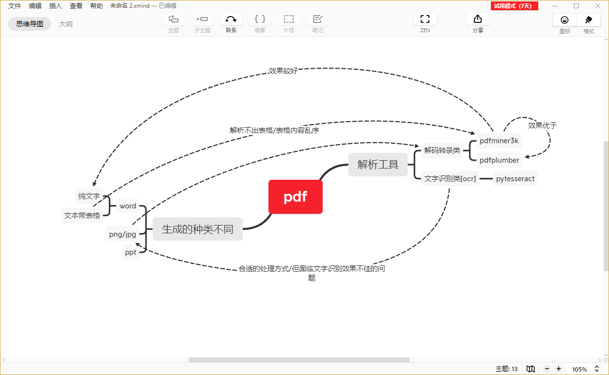

## 系统运行
### 运行代码
+ 定时运行【在终端中运行main.py】
+ 直接运行：``scrapy crawl Zixun``
### 需要的包
+ `scrapy`
+ `pdfminer3k`
+ `os`
+ `json`
+ `logging` 
### 注意事项
+ 注意修改pdf存储路径以及 文件解析路径
### 代码修改方向
+ 将文件存储路径和文件解析路径做成 公共变量，尽量只需要一次修改
+ 尽量做到对爬取的内容文本的 处理。 现在暂未找到处理表格数据较好的方法。存在较大的错位
+ 尝试的几个技术方向以及优缺点

``mark on 2020/1/21 ``
---------------------------------
